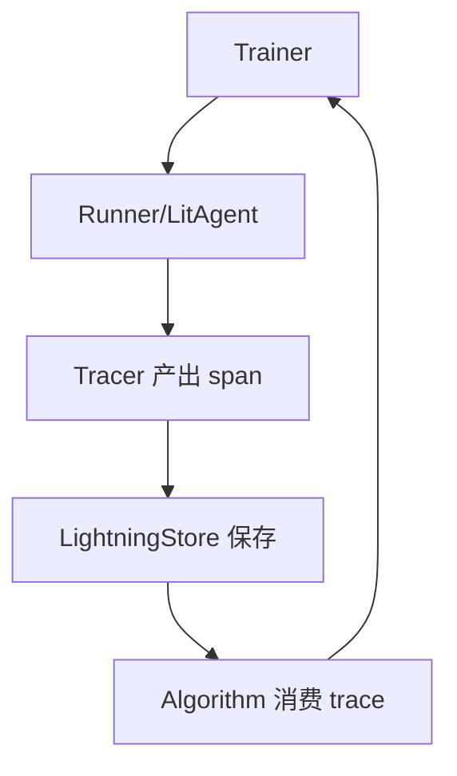
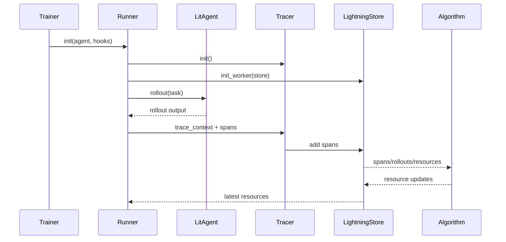

# Agent Lightning 的行为与训练闭环（含源码行号）

> 目标：基于仓库实现说明 Agent Lightning 的“行为执行、追踪、奖励、存储与训练”闭环，并标注关键源码位置。

## 1. 总体闭环与角色

**闭环关键词**：Runner 执行 → Tracer 产出 span → Store 持久化 → Algorithm 消费 → Trainer 编排

**核心模块定位**
- Trainer 统筹：`agentlightning/trainer/trainer.py`
- Runner 执行：`agentlightning/runner/agent.py`, `agentlightning/runner/base.py`
- Tracer 基类：`agentlightning/tracer/base.py`
- Store 协议：`agentlightning/store/base.py`
- Agent 基类：`agentlightning/litagent/litagent.py`
- 事件发射（message/reward）：`agentlightning/emitter/*.py`
- LLM 代理与 OTEL 导出：`agentlightning/llm_proxy.py`

## 2. Trainer：编排层

**文件**：`agentlightning/trainer/trainer.py`
- `Trainer` 聚合 Algorithm/Runner/Store/Tracer/LLMProxy（第 36-241 行）。
- 组件构建顺序：
  - Tracer 与 Adapter（第 205-216 行）
  - Algorithm 与 ExecutionStrategy（第 218-229 行）
  - Store 与 Runner（第 231-233 行）
  - LLMProxy（第 241 行）

**要点**
- Trainer 是“闭环入口”：建立 Runner+Store+Algorithm 的连接关系。
- Adapter/Tracer/LLMProxy 构成观测与优化侧通路。

## 3. Runner：行为执行与 rollouts

### 3.1 Runner 抽象
**文件**：`agentlightning/runner/base.py`
- 统一生命周期：`init` / `init_worker` / `teardown` / `teardown_worker`（第 35-95 行）。
- `iter()` 与 `step()` 定义执行接口（第 142-182 行）。

### 3.2 LitAgentRunner 实现
**文件**：`agentlightning/runner/agent.py`
- Runner 绑定 `LitAgent` 与 `LightningStore`（第 114-147 行）。
- 初始化 tracer（第 130-147 行）。
- 生命周期管理与 hook 调度（第 246-258 行）。

**要点**
- Runner 是“行为执行器”，负责从 Store 获取任务并驱动 LitAgent。
- Tracer 由 Runner 初始化并与 Store 绑定，实现 span 采集与存储。

## 4. LitAgent：行为主体

**文件**：`agentlightning/litagent/litagent.py`
- Agent 基类定义：`rollout` / `rollout_async` / `training_rollout` / `validation_rollout`（第 181-252 行）。
- Runner 与 Trainer 绑定关系：`set_runner` / `set_trainer`（第 92-147 行）。

**要点**
- LitAgent 仅负责业务逻辑与 rollout 产出。
- 追踪/存储/优化交由 Runner 与 Trainer 管理，符合单一职责。

## 5. Tracer：行为追踪与 span

**文件**：`agentlightning/tracer/base.py`
- `trace_context` 负责创建追踪上下文（第 74-96 行）。
- `get_last_trace` 用于获取 spans（第 108-115 行）。
- `create_span` / `operation_context` 提供 span 操作 API（第 134-174 行）。

**要点**
- Tracer 为“行为观测层”，将行为记录为 span。
- 可替换后端实现（AgentOps、OpenTelemetry 等）。

## 6. LightningStore：持久化与调度中心

**文件**：`agentlightning/store/base.py`
- 定义 rollout 状态机与持久化语义（第 104-124 行）。
- `start_rollout` 与 `enqueue_rollout` 作为调度入口（第 158-231 行）。

**要点**
- Store 负责任务队列、尝试管理、span 摄入与资源版本化。
- 算法侧通过 Store 获取 rollout/trace 数据做训练与更新。

## 7. 事件发射（消息与奖励）

### 7.1 Message emitter
**文件**：`agentlightning/emitter/message.py`
- `emit_message()` 以 span 形式记录消息（第 15-46 行）。

### 7.2 Reward emitter
**文件**：`agentlightning/emitter/reward.py`
- `emit_reward()` 支持单维/多维奖励（第 148-210 行）。
- `reward()` 装饰器为兼容路径（第 66-146 行）。

**要点**
- Reward/Message 都以 Span 形式进入 tracer/store。
- 奖励是算法侧训练信号的重要来源。

## 8. LLMProxy 与 OTEL 出口

**文件**：`agentlightning/llm_proxy.py`
- LiteLLM 回调 hook 可注入 token/logprobs（第 149-194 行）。
- `LightningSpanExporter` 将 OTEL span 缓冲并写入 Store（第 196-240 行）。

**要点**
- LLMProxy 作为请求层拦截与增强工具，补齐 RL 训练所需的 token 与 logprobs。
- OTEL span 被一致化导入 Store，形成统一轨迹。

## 9. 行为闭环时序图

## 10. 论文补充理解（结合实现）

基于论文 "Agent Lightning: Train ANY AI Agents with Reinforcement Learning" 的补充要点：

- **训练-代理解耦（Training-Agent Disaggregation）**：论文强调将训练系统与 agent runtime 解耦，服务端负责训练与模型更新，客户端负责 agent 执行与数据采集。对应实现中，`Trainer` 负责算法与资源调度，`Runner/LitAgent/Tracer` 负责运行与采集，`LightningStore` 作为数据与资源中枢，形成清晰分层。
- **统一数据接口（Unified Data Interface）**：论文将 agent 执行建模为 MDP，将状态/动作/奖励组织成 transition 序列。实现上以 Span/Trace 作为统一轨迹格式，`Tracer` 负责将执行过程结构化，`LightningStore` 统一保存，`Algorithm` 消费这些轨迹进行优化。
- **LightningRL 与信用分配**：论文提出层级 RL 与 credit assignment，将 trajectory-level 回报分配到每次 LLM 调用。实现中通过 `emit_reward` 与 span 机制把奖励与具体执行片段关联，为算法做信用分配提供可追溯信号。
- **可观测性驱动奖励（AIR 思路）**：论文指出用系统监控信号生成中间奖励以缓解稀疏奖励。实现上通过 `emitter/reward.py` 与 `emitter/message.py` 的 span 化事件提供标准化注入点，配合 Tracer/Store 可形成 AIR 风格的中间奖励采集链路。

## 11. 结论（工程视角）

- 行为执行与策略学习完全解耦：Runner/LitAgent 负责执行，Algorithm 负责优化。
- 所有行为与奖励都被 span 化并进入 Store，形成统一训练数据面。
- Trainer 作为“唯一编排入口”，负责把 Runner/Store/Algorithm/Tracer/LLMProxy 组织成闭环。
- 论文视角下，Agent Lightning 以统一数据接口 + 训练-代理解耦 + 可观测性奖励机制，支撑跨框架 agent 的低侵入式训练闭环。
