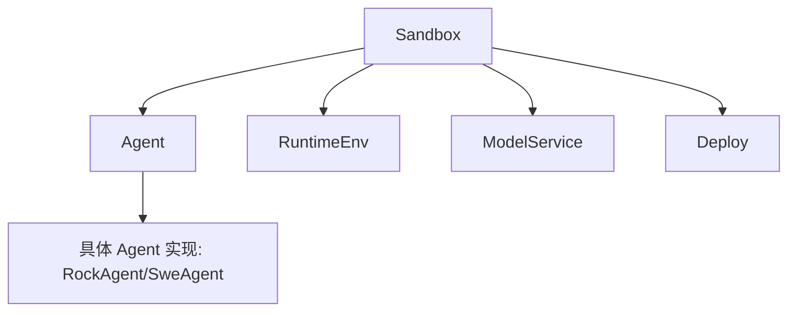
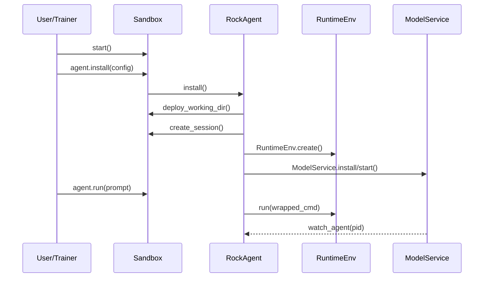
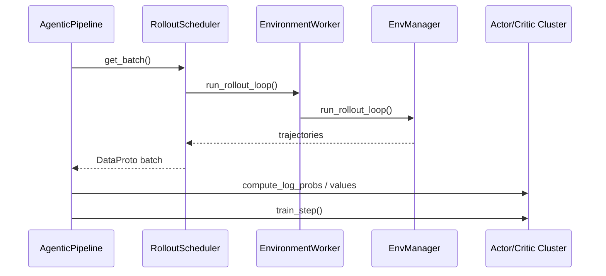

# ROCK 与 ROLL 的 Agentic RL 支撑机制（含源码行号）

> 目标：说明 ROCK 与 ROLL 如何分别在“环境/沙箱/代理/运行时/模型服务”与“分布式训练/环境 rollout/工具调用”层面支撑 Agentic RL，并标注关键源码位置。

## 1. 总体架构与角色

### 1.1 ROCK（环境与执行基础设施）

**核心角色**
- **Sandbox**：环境生命周期与动作执行的统一入口（`rock/sdk/sandbox/client.py`）。
- **Agent**：在 Sandbox 上运行的代理抽象（`rock/sdk/sandbox/agent/base.py`）。
- **RuntimeEnv**：运行时隔离与依赖环境管理（`rock/sdk/sandbox/runtime_env/base.py`）。
- **ModelService**：LLM 相关服务管理（`rock/sdk/sandbox/model_service/base.py`）。
- **Deploy**：将本地工程上传到沙箱，提供路径替换（`rock/sdk/sandbox/deploy.py`）。

**逻辑层次图**



### 1.2 ROLL（训练与 Agentic Pipeline）

**核心角色**
- **AgenticPipeline**：Agentic 训练主流程（`roll/pipeline/agentic/agentic_pipeline.py`）。
- **AgenticRolloutPipeline**：专注 rollout 采集（`roll/pipeline/agentic/agentic_rollout_pipeline.py`）。
- **EnvironmentWorker**：多环境并行执行（`roll/pipeline/agentic/environment_worker.py`）。
- **BaseEnvManager**：环境管理抽象（`roll/pipeline/agentic/env_manager/base_env_manager.py`）。
- **Tools**：MCP/代码工具（`roll/pipeline/agentic/tools/*.py`）。

## 2. ROCK：Sandbox 执行与隔离

**文件**：`rock/sdk/sandbox/client.py`
- `Sandbox.__init__` 初始化组件并挂载 `RockAgent`（第 85-105 行）。
- 核心能力包括：
  - `start()` 启动 sandbox（第 154-193 行）
  - `execute()` 执行动作（第 215-235 行）
  - 以及文件/会话/状态相关能力（同文件中其他函数）。

**关键点**
- Sandbox 作为中心对象，将 Agent/RuntimeEnv/ModelService/Deploy 组合起来，形成“可执行 Agentic RL 环境”。

## 3. ROLL：Agentic Pipeline 与环境驱动

### 3.1 AgenticRolloutPipeline（rollout 采集）
**文件**：`roll/pipeline/agentic/agentic_rollout_pipeline.py`
- 使用 `RolloutScheduler` 产出 batch（第 46-71 行）。
- 汇总 metrics 并写入 tracker（第 79-99 行）。
- 通过 `dump_rollout_trajectories()` 落盘轨迹（第 101 行）。

### 3.2 AgenticPipeline（训练主循环）
**文件**：`roll/pipeline/agentic/agentic_pipeline.py`
- 初始化 actor/critic/reference cluster（第 53-116 行）。
- rollout → reward → advantage → train 的完整闭环（第 174-293 行）。
- 通过 `compute_response_level_rewards` 与 `compute_token_reward` 注入奖励（第 248-262 行）。

### 3.3 EnvironmentWorker（环境并行）
**文件**：`roll/pipeline/agentic/environment_worker.py`
- 以“进程 + 线程”的方式并行多个环境（第 24-31 行）。
- 动态创建 `EnvManager`，并行运行 `run_rollout_loop`（第 58-118 行）。

### 3.4 BaseEnvManager（环境抽象）
**文件**：`roll/pipeline/agentic/env_manager/base_env_manager.py`
- 定义 `run_rollout_loop / reset / step / make_decision` 等抽象接口（第 29-58 行）。
- `RolloutCache` 管理 step/history/terminated 等运行态（第 9-21 行）。

### 3.5 工具接入（MCP 与 Code Tool）
**文件**：`roll/pipeline/agentic/tools/mcp_tool.py`
- 通过 MCP 协议发现与调用工具（第 16-210 行）。
- `<tool_call>` JSON 解析 → schema 校验 → 远程执行（第 66-132 行）。

**文件**：`roll/pipeline/agentic/tools/python_code_tool.py`
- 解析 `<code>...</code>` 或 ```python``` 片段并在 sandbox 运行（第 36-85 行）。

## 3. Agent 抽象与默认实现

### 3.1 Agent 抽象基类
**文件**：`rock/sdk/sandbox/agent/base.py`
- `Agent` 定义 `install()` 与 `run()` 抽象方法（第 24-35 行）。

### 3.2 DefaultAgent（通用安装与执行）
**文件**：`rock/sdk/sandbox/agent/base.py`
- 统一初始化流程（第 66-103 行）：
  1) 预初始化命令（`_execute_pre_init`）
  2) 创建 Bash 会话（`_setup_session`）
  3) 并行执行 `self._install()` 与 `ModelService` 安装（第 92-99 行）
  4) 后置命令（`_execute_post_init`）
- 执行命令使用 nohup 方式，支持长任务与输出管理（第 234-310 行）。

## 4. RockAgent：面向 Sandbox 的 Agent 实现

**文件**：`rock/sdk/sandbox/agent/rock_agent.py`
- `RockAgentConfig` 定义运行所需的配置项（第 31-159 行）。
  - 强制 `run_cmd` 含 `{prompt}` 占位符（第 100-123 行）。
  - 校验 `working_dir` 必须存在（第 143-159 行）。
- `RockAgent.install()` 负责完整初始化流程（第 189-243 行）：
  - 上传工作目录（第 221-225 行）
  - 创建 session + pre/post init（第 227-239 行）
  - 初始化 RuntimeEnv 和 ModelService（第 231-236 行）
- `RockAgent.run()` 将 prompt 注入命令并执行（第 252-268 行）。
- `_create_agent_run_cmd()` 支持 `${working_dir}` 和 `${prompt}` 模板替换（第 414-449 行）。

## 5. SweAgent：面向软件工程任务的 Agent

**文件**：`rock/sdk/sandbox/agent/swe_agent.py`
- `SweAgentConfig` 定义 SWE-agent 安装命令与默认模板（第 125-145 行）。
- `SweAgent.install()` 继承 RockAgent 的 install，并额外安装 SWE-agent（第 168-189 行）。
- `_create_agent_run_cmd()` 生成 sweagent CLI 调用（第 191-206 行）。
- `_upload_generated_config_template()` 会生成配置并上传到沙箱（第 208-221 行）。

## 6. RuntimeEnv：运行时与依赖隔离

**文件**：`rock/sdk/sandbox/runtime_env/base.py`
- `RuntimeEnv.create()` 根据配置选择具体 runtime 子类（第 47-68 行）。
- `init()` 创建会话、工作目录并安装 runtime（第 115-137 行）。
- `run()` 通过 `wrapped_cmd` 运行命令（第 139-167 行）。

**关键点**
- RuntimeEnv 是执行 Agent 命令时的隔离层，确保依赖安装与路径可控。

## 7. ModelService：LLM 服务管理

**文件**：`rock/sdk/sandbox/model_service/base.py`
- `ModelService.install()` 创建 runtime 并安装服务（第 95-114 行）。
- `ModelService.start()` 启动服务，并写入日志路径（第 131-163 行）。
- `watch_agent()` 为 agent 进程提供监控（第 181-204 行）。
- `anti_call_llm()` 允许执行特定 LLM 相关操作（第 205-274 行）。

## 8. Deploy：本地工程上传与模板替换

**文件**：`rock/sdk/sandbox/deploy.py`
- `deploy_working_dir()` 上传本地目录到 sandbox（第 33-72 行）。
- `format()` 支持 `${working_dir}` 模板替换（第 74-100 行）。

## 9. 端到端调用链示意

### 9.1 ROCK 执行链路



### 9.2 ROLL Agentic 训练链路



## 10. 结论（工程视角）

- **ROCK**：提供“可执行、可隔离、可部署”的 Agent 运行环境，是 Agentic RL 的基础设施层。
- **ROLL**：提供“可扩展的分布式训练与 Agentic Pipeline”，强调 rollout→reward→train 的闭环效率。
- 两者可以互补：ROCK 解决环境隔离与 agent 运行，ROLL 解决大规模 RL 训练与调度。

