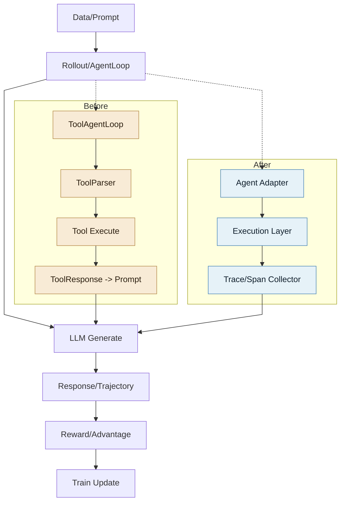
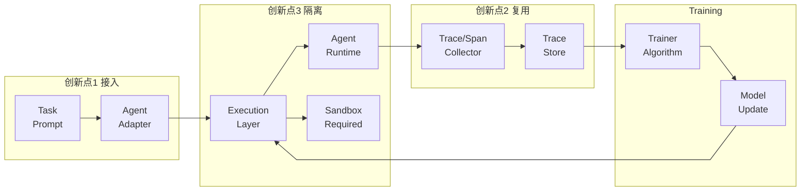

# VERL 接入 Agent 的三大痛点（PPT一页内容）

> 聚焦：抽象层级与接入侵入性 / 生态兼容性与复用成本 / 运行时隔离与环境管理

## 1. 抽象层级与接入侵入性
- 最小抽象为 Tool，必须将 agent 映射为 tool schema 与解析规则，接入路径被强约束。
- 需改写提示词与输出结构以满足 parser 约定，侵入性显著高于“直接包装或运行”。
- 工程代价：接入链路拉长、适配复杂度提升、维护成本上升。

## 2. 生态兼容性与复用成本
- 主流 agent 生态以“黑盒 rollout/可执行实体”接入为主，与 VERL 的 tool-call 约束不匹配。
- 需要额外适配 tool call 结构与解析器，迁移与复用成本显著增加。
- 工程代价：低改动迁移难、跨框架协作效率低。

## 3. 运行时隔离与环境管理
- 缺少原生强隔离与运行时统一管理，环境一致性依赖外部体系补齐。
- 多依赖/多工具/多版本场景下容易出现环境漂移与不可复现。
- 工程代价：复现成本高、生产级稳定性不足。

## 6. 对应的三个创新点（逐条对应三大痛点）
- 针对“抽象层级与接入侵入性”：引入 Agent Adapter，提供统一接口与最小包装接入，兼容 tool 与非 tool 形态。
- 针对“生态兼容性与复用成本”：定义标准输出契约，弱化对 tool-call 解析的强依赖，降低跨框架迁移成本。
- 针对“运行时隔离与环境管理”：Execution Layer 可插拔，支持本地与 Sandbox 运行，提供可复现与隔离能力。

## 4. VERL 主流程：改进前后对比（一张图）

## 5. 改进后接入方式架构图

