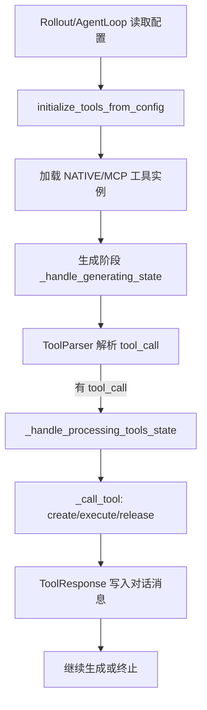
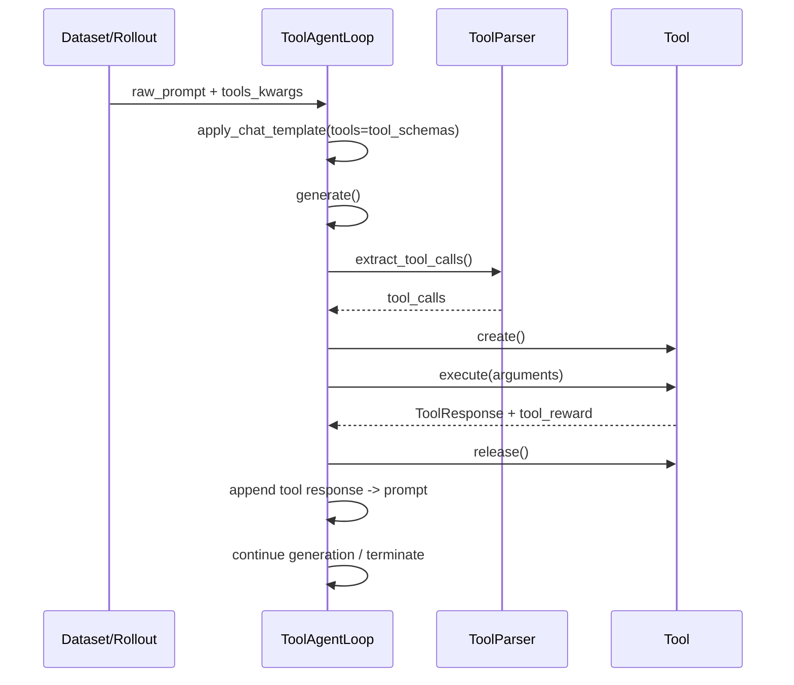

# VERL 中 Agentic RL 的工具调用机制（含源码行号）

> 目标：说明在 VERL 中，Agentic RL 如何从配置加载工具、在 agent loop 中解析/执行工具调用，并把工具结果与奖励回流到训练与采样流程中。

## 1. 核心入口与总体流程

**总体流程概览**

**关键组件**
- 工具基类与 schema：`verl/verl/tools/base_tool.py`、`verl/verl/tools/schemas.py`
- 工具注册与初始化：`verl/verl/tools/utils/tool_registry.py`
- Agent 循环与工具调用：`verl/verl/experimental/agent_loop/tool_agent_loop.py`
- Tool call 解析器：`verl/verl/experimental/agent_loop/tool_parser.py`

## 2. 工具加载与注册

### 2.1 工具基类
**文件**：`verl/verl/tools/base_tool.py`
- `BaseTool.__init__` 负责保存配置与 OpenAI tool schema（第 36-41 行）。
- 约定接口：`create`、`execute`、`calc_reward`、`release`（第 46-93 行）。

### 2.2 Tool schema 与 ToolResponse
**文件**：`verl/verl/tools/schemas.py`
- `OpenAIFunctionToolSchema` / `OpenAIFunctionSchema` 用于描述工具（第 48-53 行）。
- `ToolResponse` 支持 `text/image/video`，并强制 `image/video` 为 list（第 94-117 行）。

### 2.3 工具初始化入口
**文件**：`verl/verl/tools/utils/tool_registry.py`
- `initialize_tools_from_config()` 读取配置并初始化工具列表（第 82-142 行）。
- 支持两类工具：
  - `ToolType.NATIVE`：直接实例化工具类（第 117-127 行）。
  - `ToolType.MCP`：通过 MCP 客户端拉取工具 schema 并实例化（第 128-130 行）。
- MCP 初始化通过临时 event loop 与线程实现，避免常驻 loop 泄露（第 91-141 行）。

### 2.4 典型配置示例
**文件**：`verl/examples/sglang_multiturn/config/tool_config/sandbox_fusion_tool_config.yaml`
- 定义 `code_interpreter` 工具 schema 与 native 运行配置（第 1-24 行）。

**文件**：`verl/examples/sglang_multiturn/config/tool_config/search_tool_config.yaml`
- 定义 `search` 工具（第 1-23 行）。

**文件**：`verl/examples/sglang_multiturn/config/tool_config/mcp_tool_config.yaml`
- MCP 工具配置（第 1-11 行），通过 `mcp_servers_config_path` 获取远端 tool schema。

## 3. Agentic RL 中的工具调用状态机

### 3.1 ToolAgentLoop 初始化
**文件**：`verl/verl/experimental/agent_loop/tool_agent_loop.py`
- 读取 `tool_config_path` 并调用 `initialize_tools_from_config`（第 114-116 行）。
- 构建 `self.tools`（name->tool 实例）与 `self.tool_schemas`（第 116-117 行）。
- 通过 `ToolParser.get_tool_parser()` 选择解析器（第 118-121 行）。

### 3.2 生成阶段：解析 tool call
**文件**：`verl/verl/experimental/agent_loop/tool_agent_loop.py`
- 在 `_handle_generating_state()` 中执行模型生成（第 228-249 行）。
- 调用 `self.tool_parser.extract_tool_calls()` 从模型输出解析函数调用（第 261-263 行）。
- 若发现 tool_call 则进入 `PROCESSING_TOOLS` 状态（第 273-275 行）。

### 3.3 工具执行阶段
**文件**：`verl/verl/experimental/agent_loop/tool_agent_loop.py`
- `_handle_processing_tools_state()` 收集 tool_call 并并发执行（第 280-293 行）。
- 每个 tool_call 由 `_call_tool()` 负责执行（第 416-464 行）：
  - `tool.create()` 创建实例（第 427 行）。
  - `tool.execute()` 执行并返回 `ToolResponse` 与 `tool_reward`（第 428-430 行）。
  - `tool.release()` 释放实例（第 441-442 行）。
- 结果写回对话：将 `ToolResponse` 转换为 `role=tool` 消息（第 297-317 行）。
- 若 tool 产生图片，会追加到 `image_data`（第 320-371 行）。

### 3.4 结果拼接与继续生成
- 工具输出会被再次 `apply_chat_template()` 组装进 prompt（第 353-358 行）。
- 然后重新进入 `GENERATING`（第 377 行）。

## 4. Tool Call 解析器

### 4.1 Hermes Parser
**文件**：`verl/verl/experimental/agent_loop/tool_parser.py`
- 识别 `<tool_call>...</tool_call>` 片段（第 82-104 行）。
- JSON 解码后生成 `FunctionCall`（第 94-99 行）。

### 4.2 GPT-OSS Parser
**文件**：`verl/verl/experimental/agent_loop/tool_parser.py`
- 使用特殊 token 模式匹配 gpt-oss 工具调用（第 121-131 行）。
- 抽取 name 与 arguments（第 150-155 行）。

## 5. 与 RL 数据流的衔接

**文件**：`verl/verl/utils/dataset/rl_dataset.py`
- `RLHFDataset` 在加载数据时可读取 `tool_config_path` 以获取 tool schema（第 117-127 行）。
- 过滤长 prompt 时会把 tools 传入 `apply_chat_template`（第 193-203 行；第 242-248 行）。
- 在 `__getitem__` 中从样本的 `extra_info` 读取 `tools_kwargs`，并传给 agent loop（第 354-360 行）。

**文件**：`verl/verl/experimental/agent_loop/tool_agent_loop.py`
- `agent_data.tool_rewards` 收集 `tool_reward`（第 341-343 行）。
- 最终 `AgentLoopOutput.extra_fields` 写入 `tool_rewards` 与 `turn_scores`（第 208-209 行）。

## 6. 端到端顺序图

## 7. 关键要点总结
- 工具配置通过 `tool_config_path` 注入，支持 `NATIVE` 与 `MCP` 两种类型（`tool_registry.py` 82-142 行）。
- ToolAgentLoop 在生成后解析 tool call，触发并发工具执行，并将工具结果写回对话上下文（`tool_agent_loop.py` 261-358 行）。
- 工具输出与奖励被记录并回流到 rollout 输出中（`tool_agent_loop.py` 341-343 行与 208-209 行）。
- RL 数据集处理时也会读取 tool schema 用于构造对话模板与长度过滤（`rl_dataset.py` 117-248 行）。
